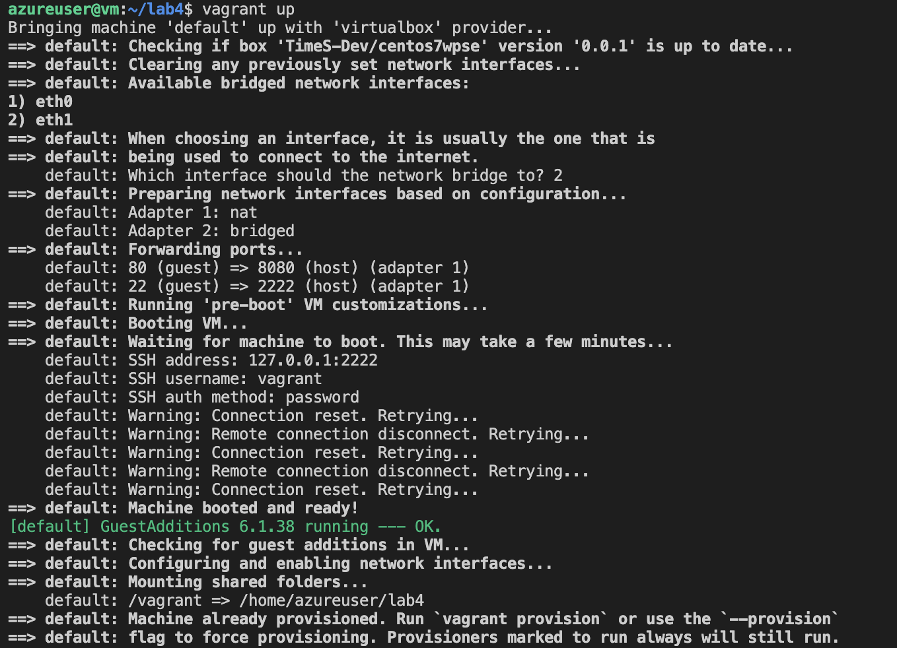

# itran-lab4

1. Create an AZURE virtual machine

2. Install all the staff from install.sh file

# run these commands

-> vagrant up

-> ssh -i "provided_pem_key" azureuser@provided_ip

Vagrantfile consists a string that load up some configs to allow access the website

2. Vagrantfile consists a string that load up some configs to allow access the website

'''
UPDATE wp_options SET option_value="http://10.0.1.100" WHERE option_name="siteurl";
UPDATE wp_options SET option_value="http://10.0.1.100" WHERE option_name="home";
'''